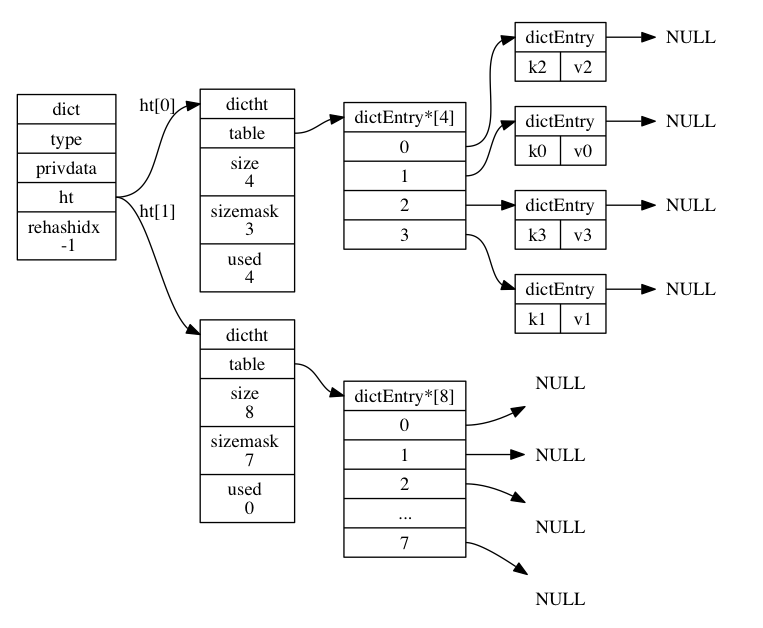
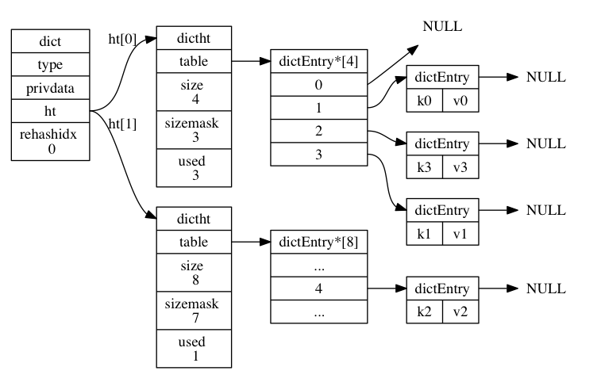
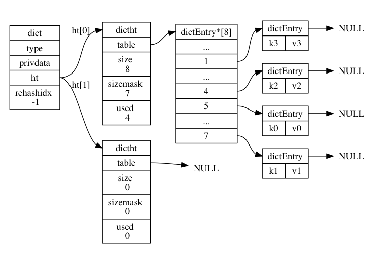

Redis的字典使用哈希表 作为底层实现，一个哈希表里面可以有多个哈希表节点，而每一个哈希表节点保存了一个键值对。
1. 哈希表
>Redis字典所使用的哈希表在`dict.h/dictht`结构定义。
```C++
typedef struct dictht {
	//哈希表数组
	dictEntry **table;
	//哈希表大小
	unsigned long size;
	//哈希表掩码，用于计算索引值
	//总是等于size-1
	unsigned long sizemask;
	//该哈希表已有的节点数量
	unsigned long used;
}dictht;
```
><!--more-->
各个属性介绍都在注释里，这里值得注意的是`sizemask`属性的值总是等于`size-1`,这个属性值和哈希值一起决定一个键值对应该被放在`table`的哪个索引上。
以下为一个大小为4的空哈希表（没有任何键值对）：


2. 哈希表节点
>哈希表节点使用`dictEntry`结构表示，每个`dictEntry`结构都保存着一个键值对。
```C++
typedef struct dictEntry {
	//键
	void *key;
	//值
	union {
		void *val;
		uint64_t u64;
		int64_t s64;
	}v;
	//指向下一个哈希表节点，形成链表。
	struct dictEntry *next;
}dictEntry;
```
其中`v`属性则保存着键值对中的值，其中这个值可以是一个指针、uint64、int64.
重点是`next`属性，这个是为了解决哈希键值冲突的问题，当多个键值对哈希值相同时，就需要用这个`next`来构成链表。

3. 字典
>Redis中的字典由dict.h/dict结构表示
```C++
typedef struct dict {
	//类型特定函数（具体在下文）
	dictType *type;
	//私有数据
	void * privdata;
	//哈希表（固定有两个哈希表）
	//一般只用一个，另一个在rehash的时候需要用到
	dictht ht[2];
	//rehash索引
	//在rehash进行的时候使用，默认值-1
	int rehashidx;
}dict;
```
属性`type`和`privdata`是针对不同类型的键值对，为创建多态字典而设计的。
属性`ht[0]`是常用的，`ht[1]`和`rehashidx`在rehash操作的时候一起使用。
以下为一个默认状态（没有在rehash状态）的字典


4. **哈希算法**
>当一个新的键值对添加到字典中时，程序根据键值对计算出对应的哈希值，然后根据`sizemask`计算出对应的索引，然后添加到对应位置。
>
>Redis计算哈希值和索引值的方法：
>```C++
>//使用字典设置的哈希函数，计算key的哈希值
>hash = dict->type->hashFunction(key);
>
>//使用哈希表的sizemask属性和哈希值，计算出索引值
>//根据情形，ht[x]可以是ht[0]或ht[1]
>index = hash & dict->ht[x].sizemask;
>```

PS:Redis计算哈希值使用的MurmurHash2算法。

5. **rehash**
>哈希表负载因子
>```C++
>//负载因子 = 哈希表已存节点数 / 哈希表大小
>load_factor = ht[0].used / ht[0].size
>```
当以下两个条件任意一个满足时，程序会对哈希表执行扩展操作：
- 服务器目前没有执行`BGSAVE`或者`BGREWRITEAOF`命令，并且负载因子大于等于`1`。
- 服务器当前正在执行`BGSAVE`或者`BGREWRITEAOF`命令，并且负载因子大于等于`5`。
>根据是否在执行执行`BGSAVE`或者`BGREWRITEAOF`命令，服务器执行扩展的负载因子不同，这是因为在执行这两个命令的时候，Redis需要创建当前服务器的子进程，而大多数操作系统都采用写时复制`copy-on-write`技术来优化子进程的使用效率，所以子进程存在期间，提高负载因子，减少在子进程存在期间进行哈希表扩展操作，可以避免不必要的内存写入，节约内存。
>此外，当哈希表的负载因子小于`0.1`时，程序自动开始对哈希表进行收缩操作。
>rehash操作实际上就是把`ht[0]`中的键值对重新计算在`ht[1]`中的哈希值和索引值，然后添加。
rehash的详细步骤：
>1. 为`ht[1]`分配对应的空间,让字典同时有两个哈希表`ht[0]、ht[1]`。
>2. 在字典中维持一个索引计数变量`rehashidx`，并将它的值设置为`0`，表示当前开始rehash操作。
>3. 在rehash期间（这个操作可能比较久，是一个渐进式过程），每次都字典执行增删修、查找时，还会顺带把`ht[0]`哈希表在rehashidx索引上的所有键值对rehash到`ht[1]`中，每一次rehash结束时，程序将`rehashidx`值增加1。
>4. 随着字典操作的进行，最终rehash操作结束，`ht[0]`中的键值对全部移至`ht[1]`中，此时将`ht[0]`释放，`ht[1]`设为`ht[0]`，新创建一个`ht[1]`，同时设置`rehashidx`为`-1`，rehash操作结束。
PS:在进行rehash过程中，更新、查询、删除会在两个表中进行，先在`ht[0]`中找，未找到，则再在`ht[1]`中找。但是新增操作会直接在`ht[1]`中操作，保证了`ht[0]`只减不增，最后变为空表。

以下为一次rehash过程图解：
>准备开始rehash：
>


>rehash索引0上的键值对:
>


>rehash索引1上的键值对:
>


>以此类推
>.
>.
>.
>rehash执行完毕
>



6. 字典操作的主要API
<table><tr><td>函数</td><td>作用</td><td>时间复杂度</td></tr><tr><td>dictCreate</td><td>创建一个新的字典。</td><td>O(1)</td></tr><tr><td>dictAdd</td><td>将给定的键值对添加到字典里面。</td><td>O(1)</td></tr><tr><td>dictReplace</td><td>将给定的键值对添加到字典里面， 如果键已经存在于字典，那么用新值取代原有的值。</td><td>O(1)</td></tr><tr><td>dictFetchValue</td><td>返回给定键的值。</td><td>O(1)</td></tr><tr><td>dictGetRandomKey</td><td>从字典中随机返回一个键值对。</td><td>O(1)</td></tr><tr><td>dictDelete</td><td>从字典中删除给定键所对应的键值对。</td><td>O(1)</td></tr><tr><td>dictRelease</td><td>释放给定字典，以及字典中包含的所有键值对。</td><td>O(N) ， N 为字典包含的键值对数量。</td></tr></table>