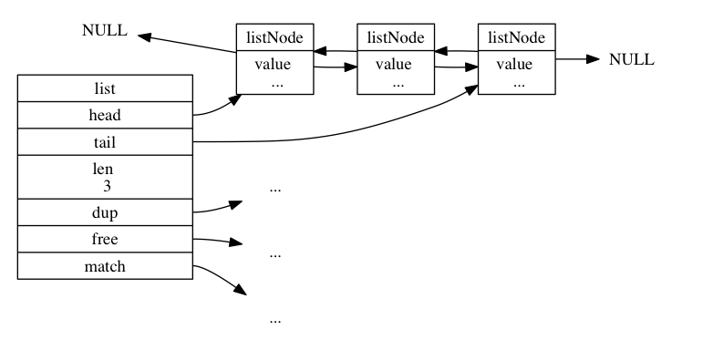

Redis的链表结构解析
1. 链表节点定义
>链表节点结构`adlist.h/listNode`
```C++
typedef struct listNode {
	//前置节点
	struct listNode *prev;
	//后置节点
	struct listNode *next;
	//节点的值
	void *value;

}listNode;
```
由于有`prev`和`next`，多个`listNode`可以组成双端链表结构。

<!--more-->

2. list定义
>链表定义结构`adlist.h/list`
```C++
typedef struct list{
	//链表的头结点
	listNode *head;
	//链表的尾结点
	listNode *tail;
	//链表长度（节点数）
	unsigned long len;
	//链表节点值复制函数
	void *(*dup)(void *ptr);
	//节点值释放函数
	void (*free)(void *ptr);
	//节点值对比函数
	int(*match)(void *ptr, void *key);

}list;
```
list结构为链表提供了表头指针`head`、表尾指针`tail`，以及链表长度`len`，另外的`dup、free、match`则是用于实现多态链表所需的类型特定函数。
- `dup`函数用于复制链表节点所保存的值；
- `free`函数用于释放链表节点所保存的值；
- `match`函数则用于对比链表节点所保存值和另一个输入的值是否相等。
一个list结构和三个listNode结构组成的链表结构如下图：



3. 链表实现的特性
- 双端：链表节点带有`prev`和`next`指针，获取某个节点的前置和后置节点的复杂度都是O(1)。
- 无环：表头节点的`prev`指针和表尾的`next`指针都指向`NULL`对链表的访问以`NULL`为终点。
- 带表头指针和表尾指针：获取表头和表尾的时间复杂度O(1)。
- 带链表长度计数器：通过`list`的`len`值可以直接获取该链表的节点数，时间复杂度O(1)。
- **多态**：链表节点使用`void*`保存节点值，并且可以通过`dup、free、match`为节点值设置特定的类型，链表各节点可以保存不同类型的值。

4. 链表节点和链表的所有API

<table><tr><td>函数</td><td>作用</td><td>时间复杂度</td></tr><tr><td>listSetDupMethod</td><td>将给定的函数设置为链表的节点值复制函数。</td><td>O(1) 。</td></tr><tr><td>listGetDupMethod</td><td>返回链表当前正在使用的节点值复制函数。</td><td>复制函数可以通过链表的 dup 属性直接获得， O(1)</td></tr><tr><td>listSetFreeMethod</td><td>将给定的函数设置为链表的节点值释放函数。</td><td>O(1) 。</td></tr><tr><td>listGetFree</td><td>返回链表当前正在使用的节点值释放函数。</td><td>释放函数可以通过链表的 free 属性直接获得， O(1)</td></tr><tr><td>listSetMatchMethod</td><td>将给定的函数设置为链表的节点值对比函数。</td><td>O(1)</td></tr><tr><td>listGetMatchMethod</td><td>返回链表当前正在使用的节点值对比函数。</td><td>对比函数可以通过链表的 match 属性直接获得，O(1)</td></tr><tr><td>listLength</td><td>返回链表的长度（包含了多少个节点）。</td><td>链表长度可以通过链表的 len 属性直接获得， O(1) 。</td></tr><tr><td>listFirst</td><td>返回链表的表头节点。</td><td>表头节点可以通过链表的 head 属性直接获得， O(1) 。</td></tr><tr><td>listLast</td><td>返回链表的表尾节点。</td><td>表尾节点可以通过链表的 tail 属性直接获得， O(1) 。</td></tr><tr><td>listPrevNode</td><td>返回给定节点的前置节点。</td><td>前置节点可以通过节点的 prev 属性直接获得， O(1) 。</td></tr><tr><td>listNextNode</td><td>返回给定节点的后置节点。</td><td>后置节点可以通过节点的 next 属性直接获得， O(1) 。</td></tr><tr><td>listNodeValue</td><td>返回给定节点目前正在保存的值。</td><td>节点值可以通过节点的 value 属性直接获得， O(1) 。</td></tr><tr><td>listCreate</td><td>创建一个不包含任何节点的新链表。</td><td>O(1)</td></tr><tr><td>listAddNodeHead</td><td>将一个包含给定值的新节点添加到给定链表的表头。</td><td>O(1)</td></tr><tr><td>listAddNodeTail</td><td>将一个包含给定值的新节点添加到给定链表的表尾。</td><td>O(1)</td></tr><tr><td>listInsertNode</td><td>将一个包含给定值的新节点添加到给定节点的之前或者之后。</td><td>O(1)</td></tr><tr><td>listSearchKey</td><td>查找并返回链表中包含给定值的节点。</td><td>O(N) ， N 为链表长度。</td></tr><tr><td>listIndex</td><td>返回链表在给定索引上的节点。</td><td>O(N) ， N 为链表长度。</td></tr><tr><td>listDelNode</td><td>从链表中删除给定节点。</td><td>O(1) 。</td></tr><tr><td>listRotate</td><td>将链表的表尾节点弹出，然后将被弹出的节点插入到链表的表头， 成为新的表头节点。</td><td>O(1)</td></tr><tr><td>listDup</td><td>复制一个给定链表的副本。</td><td>O(N) ， N 为链表长度。</td></tr><tr><td>listRelease</td><td>释放给定链表，以及链表中的所有节点。</td><td>O(N) ， N 为链表长度。</td></tr></table>
